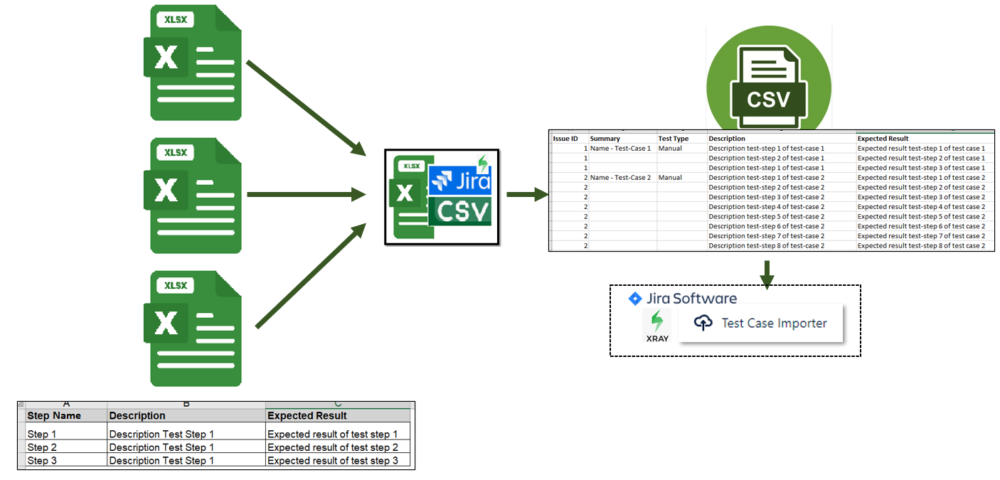

# CreateJiraCsvToImportMultipleTestCasesInXray

- This Program can be used to attach several test-cases in one big csv file wich can be imported into XRAY. Functionality will be explained in the fallowing picture.  
   <b> NOTES TO THE PROGRAM </b>   
  - The input files need to have these columns, see picture.  
  - A Summary colum will be created with the name of each the test-case.  
  - The first column in the created csv (./jira_import/multiple_testcases_file_for_jira.csv) represents the test-case numer which need to be mapped to the column "Issue ID" in Xray( All other Columns have the same name as the equivalent columns in XRAY). 
  - These 5 columns are required otherwise the csv will be rejected from XRAY. 

###  PROGRAM USAGE (EXECUTABLE)
1. You have to download the executable from executable folder
2. You have to create these folders before running  the program (Need to be placed in the same location as the executable)  
   <b>input</b> -  (contains the test-cases in xlsx format)</b> 
   <b>output</b> - (empty folder - here the testcases will be stored in csv files)</b> 
   <b>jira_import </b>- (empty folder - here the combined.csv and the multiple_testcases_file_for_jira will be saved as csv files)</b> 
 The **_combined.csv_** contains all test-cases attached
   The **_multiple_testcases_file_for_jira.csv_** contains all testcases with the correct header and with the correct format for a valid XRAY import. 
 
3. Open the CMD in the current dir and run the program (otherwise you will not see the loging and the program closes immediately after execution)
 

